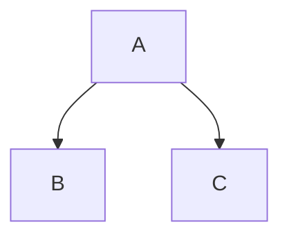
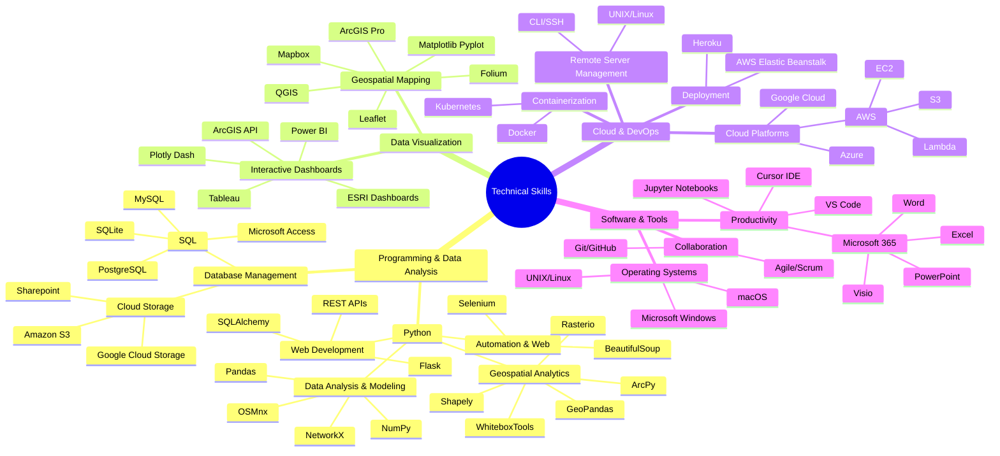

### Welcome to my site!

I'm a GIS analyst and developer with a background in physics, currently focused on broadband infrastructure planning and geospatial analytics. I build spatial models to help determine internet coverage, funding eligibility, and optimize where new networks should go. A big part of my work involves writing Python scripts to automate repetitive geoprocessing tasks, designing ETL pipelines to clean and move data, and working with spatial databases to run complex queries efficiently.

I often use cloud platforms like AWS to scale up data processing or host dashboards and services for clients and internal teams. More recently, I've started integrating AI tools to support tasks like data extraction, report generation, or classification workflows. Whether it's deploying an ArcGIS solution, wrangling data with Python, or building something from scratch with open-source tools, I aim to make spatial analysis faster, clearer, and easier to share.

The diagram below maps out the different technologies and methods I use to do that.

